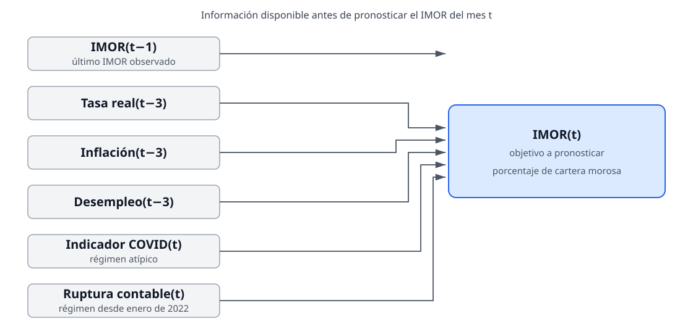

# La regresión dinámica no supera al benchmark de persistencia

## Resumen ejecutivo

Con el corte de datos disponible hasta julio de 2026, la regresión dinámica
OLS con errores HAC/Newey-West no mejora el pronóstico a un mes del IMOR de
consumo de las Sofipos frente al benchmark de persistencia.

- En la prueba final de doce meses, la regresión tuvo un MAE de **0.529 puntos
  porcentuales (pp)**, frente a **0.314 pp** de persistencia: un deterioro de
  **68.6%** respecto del benchmark.
- La regresión sobreestimó el IMOR en los doce meses de prueba, con un sesgo
  medio de **+0.529 pp**. Persistencia tuvo un sesgo cercano a cero
  (**−0.016 pp**).
- La serie es altamente persistente: el coeficiente de IMOR rezagado es 0.925.
  Las variables macro no añadieron precisión predictiva suficiente en esta
  muestra.
- La heterocedasticidad, la colinealidad moderada de los predictores macro y
  la imposibilidad de estimar una sensibilidad sin pandemia limitan la lectura
  estructural de los coeficientes.

La recomendación para el MVP es mantener persistencia como referencia
predictiva y no presentar la regresión como un modelo superior. Los resultados
son predictivos, no evidencia de causalidad.

## Alcance y trazabilidad

| Elemento | Definición |
|---|---|
| Variable objetivo | IMOR de consumo agregado de Sofipos, en porcentaje |
| Periodo disponible | Enero de 2017 a julio de 2026 |
| Calidad de la tabla | 115 meses, sin meses faltantes ni duplicados |
| Muestra de persistencia | 114 filas con IMOR rezagado disponible |
| Muestra completa de regresión | 100 filas con todos los rezagos macro disponibles |
| Entrenamiento de regresión | Abril de 2018 a julio de 2025; 88 filas |
| Prueba final | Agosto de 2025 a julio de 2026; 12 filas |
| Backtest expansivo | 4 pronósticos dentro del entrenamiento |

La regresión requiere casos completos para IMOR `t-1`, tasa real, inflación y
desempleo `t-3`, más indicadores de pandemia y ruptura contable. Por ello su
muestra efectiva es menor que la del benchmark. El mínimo de 84 observaciones
para la regresión conserva al menos 12 observaciones por cada uno de sus siete
coeficientes, incluido el intercepto.

Para regenerar este corte desde una extracción válida:

```bash
make datos
make validar
make modelar
make evaluar-modelos
```

Los archivos crudos, los Parquet de predicciones y los reportes JSON no se
versionan; el manifiesto de descargas registra sus checksums, URL y fecha de
extracción bajo `data/interim/`.

## Modelos comparados

### Persistencia

El benchmark usa una sola regla: **pronóstico de IMOR(t) = IMOR observado en
t−1**.

### Regresión dinámica

La especificación se definió antes de evaluar la prueba final. En texto:

> IMOR(t) = intercepto + IMOR(t−1) + tasa real(t−3) + inflación(t−3) +
> desempleo(t−3) + indicador COVID(t) + ruptura contable(t) + error.

Se estima por OLS y se reportan errores estándar HAC/Newey-West con un máximo
de tres rezagos. La corrección HAC mejora la inferencia bajo autocorrelación u
heterocedasticidad; no transforma por sí sola un modelo en un mejor
pronosticador.

### Variables y temporalidad de la regresión



| Variable | Papel | Información disponible al pronosticar `t` | Uso en el modelo |
|---|---|---|---|
| IMOR de consumo | Objetivo | No se conoce todavía en `t` | Variable a pronosticar, en porcentaje. |
| IMOR `t-1` | Persistencia | Sí, es el último dato de cartera observado | Resume la inercia reciente de la morosidad. |
| Tasa real `t-3` | Condición financiera | Sí, tres meses antes | TIIE promedio mensual menos inflación interanual. |
| Inflación `t-3` | Condición de precios | Sí, tres meses antes | Variación interanual del INPC. |
| Desempleo `t-3` | Condición laboral | Sí, tres meses antes | Tasa de desocupación nacional desestacionalizada. |
| Indicador COVID `t` | Régimen atípico | Sí, está definido por el calendario | Vale 1 entre marzo de 2020 y diciembre de 2021. |
| Ruptura contable `t` | Régimen contable | Sí, está definido por el calendario | Vale 1 desde enero de 2022. |

Por ejemplo, para pronosticar el IMOR de agosto de 2025, el modelo usa el IMOR
observado de julio de 2025, las tres variables macro de mayo de 2025 y los dos
indicadores calendarios de agosto. No usa el IMOR observado de agosto ni
variables macro posteriores a mayo; esa separación evita fuga de información
del futuro.

## Desempeño fuera de muestra

| Métrica, prueba final | Regresión dinámica | Persistencia | Lectura |
|---|---:|---:|---|
| MAE | 0.529 pp | 0.314 pp | La regresión comete 69% más error absoluto. |
| RMSE | 0.687 pp | 0.449 pp | Sus errores grandes también son mayores. |
| Sesgo medio | +0.529 pp | −0.016 pp | La regresión sobreestima sistemáticamente; persistencia está casi centrada. |
| MASE | 1.406 | 0.834 | La regresión queda por encima de la escala ingenua de entrenamiento. |
| Mejora frente a persistencia | −68.6% | 0.0% | La regresión empeora, no mejora, el MAE. |

El backtest expansivo muestra el mismo patrón, aunque sólo ofrece cuatro
cortes: MAE de 0.303 pp para la regresión frente a 0.099 pp para persistencia.
La muestra de backtest es demasiado pequeña para establecer una diferencia
estable, pero no contiene evidencia de valor predictivo adicional de la
regresión.

### Errores de la prueba final

`Error = predicción − IMOR observado`; un valor positivo implica
sobreestimación.

| Mes | IMOR observado | Error regresión | Error persistencia | Menor error absoluto |
|---|---:|---:|---:|---|
| Ago-2025 | 10.703 | +0.540 pp | +0.238 pp | Persistencia |
| Sep-2025 | 10.613 | +0.511 pp | +0.090 pp | Persistencia |
| Oct-2025 | 10.544 | +0.614 pp | +0.069 pp | Persistencia |
| Nov-2025 | 10.579 | +0.504 pp | −0.035 pp | Persistencia |
| Dic-2025 | 10.926 | +0.141 pp | −0.346 pp | Regresión |
| Ene-2026 | 9.648 | +1.843 pp | +1.278 pp | Persistencia |
| Feb-2026 | 9.817 | +0.462 pp | −0.169 pp | Persistencia |
| Mar-2026 | 10.329 | +0.171 pp | −0.512 pp | Regresión |
| Abr-2026 | 10.558 | +0.422 pp | −0.229 pp | Persistencia |
| May-2026 | 10.871 | +0.270 pp | −0.313 pp | Regresión |
| Jun-2026 | 11.243 | +0.120 pp | −0.372 pp | Regresión |
| Jul-2026 | 11.128 | +0.750 pp | +0.115 pp | Persistencia |

La regresión tuvo menor error absoluto en cuatro de los doce meses. El patrón
dominante es una predicción demasiado alta: todos sus errores fueron positivos.

## Coeficientes y lectura económica prudente

| Término | Estimación | IC 95% HAC | Valor p | Lectura limitada |
|---|---:|---:|---:|---|
| Intercepto | 4.421 | 0.385 a 8.457 | 0.032 | No tiene una interpretación económica aislada: fija un nivel bajo valores cero de predictores. |
| IMOR `t-1` | 0.925 | 0.832 a 1.018 | <0.001 | Alta persistencia; explica la fortaleza del benchmark. |
| Tasa real `t-3` | −0.135 | −0.285 a 0.015 | 0.077 | Estimación imprecisa; el intervalo incluye cero. |
| Inflación `t-3` | −0.193 | −0.381 a −0.006 | 0.044 | Asociación condicional negativa, no una relación causal demostrada. |
| Desempleo `t-3` | −0.529 | −1.324 a 0.265 | 0.191 | Evidencia insuficiente para una conclusión precisa. |
| Indicador COVID | −0.361 | −1.024 a 0.301 | 0.285 | No permite separar un desplazamiento propio de la pandemia. |
| Ruptura contable | −0.386 | −0.946 a 0.173 | 0.176 | No hay precisión suficiente para confirmar un nivel distinto. |

Los coeficientes describen asociaciones condicionales dentro de esta muestra.
No identifican el efecto causal de una tasa, inflación o desempleo sobre la
morosidad; las variables macro se mueven conjuntamente y la muestra es corta.

## Diagnósticos y limitaciones

| Diagnóstico | Resultado | Implicación |
|---|---:|---|
| Durbin–Watson | 1.760 | Sugiere cierta autocorrelación positiva residual, no extrema. |
| Breusch–Pagan, valor p | 0.0028 | Hay evidencia contra varianza constante; justifica reportar inferencia HAC. |
| VIF tasa real | 7.596 | Colinealidad moderada-alta con otros predictores macro. |
| VIF inflación | 6.360 | Coeficientes macro individuales son sensibles a la especificación. |
| VIF desempleo | 5.818 | Refuerza la cautela al interpretar signos y significancia. |
| Predicciones fuera de 0–100 | 0 | El rango es coherente, pero no demuestra buen desempeño. |
| Sensibilidad sin pandemia | No estimable | Excluir los meses COVID deja 66 filas, menos de las 84 mínimas acordadas. |

La tabla analítica superó los controles de grano, integridad y rango, pero la
muestra tiene menos de 120 meses. La evaluación usa datos históricos revisados,
no vintages de publicación; por tanto no debe presentarse como una simulación
de información disponible en tiempo real.

## Decisión para el MVP

La fase de regresión dinámica queda cerrada con estas decisiones:

1. Usar persistencia como referencia predictiva principal del MVP.
2. Conservar la regresión como sensibilidad interpretable, sin usar sus
   coeficientes para afirmaciones causales o regulatorias.
3. No modificar su especificación para optimizar la prueba final observada.
4. Repetir la evaluación sólo cuando se incorporen nuevos meses o exista una
   fuente oficial compatible que amplíe la historia de IMOR.
5. Evaluar ETS como siguiente candidato univariado bajo el protocolo fijado en
   el [plan de implementación de ETS](../docs/plan-ets.md). La evaluación no
   reabrirá esta regresión ni reutilizará la prueba final para elegir
   especificaciones.
